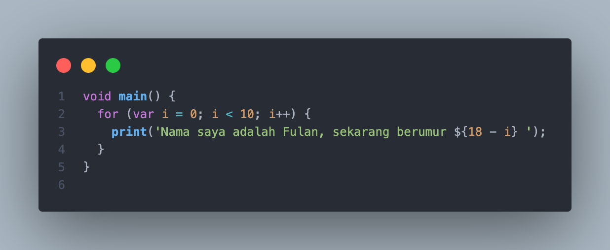
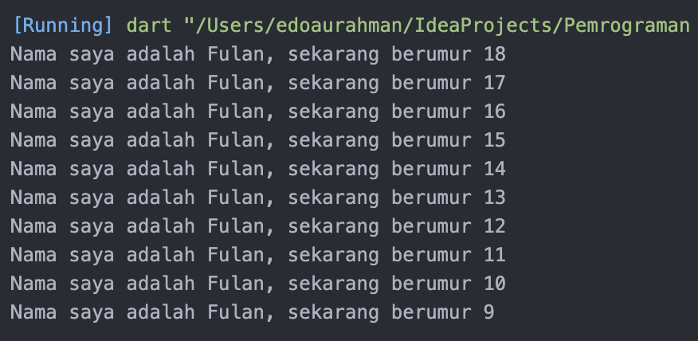

# Pemrograman Mobile - Pertemuan 2

<table>
    <thead>
        <th style="text-align: center;" colspan="2">Pertemuan 2</th>
    </thead>
    <tbody>
        <tr>
            <td>Nama</td>
            <td>Ridho Aulia' Rahman</td>
        </tr>
        <tr>
            <td>Nim</td>
            <td>2241720162</td>
        </tr>
    </tbody>
</table>

# Soal 1
Modifikasi kode pada baris 3

Output :

# Soal 2
Karena bahasa Dart adalah inti dari framework Flutter. Memahami Dart sangat penting untuk bekerja dengan Flutter, karena semua kode aplikasi, plugin, dan manajemen dependensi menggunakan bahasa ini. Memahami dasar-dasar Dart akan memudahkan pengembangan dengan Flutter.

# Soal 3 (Rangkuman)

Dart adalah bahasa inti untuk kerangka kerja Flutter, yang sangat penting untuk mengembangkan aplikasi mobile.

Dart bertujuan untuk menggabungkan kelebihan-kelebihan dari sebagian besar bahasa tingkat tinggi dengan fitur-fitur bahasa pemrograman terkini, antara lain sebagai berikut:

- Productive tooling:  menganalisis kode, plugin IDE, dan ekosistem paket yang besar.
- Garbage collection: untuk mengelola atau menangani dealokasi memori.
- Type annotations: untuk keamanan dan konsistensi dalam mengontrol semua data dalam aplikasi.
- Statically typed: fitur type-safe dan type inference untuk menganalisis types saat runtime.
- Portability: bahasa Dart tidak hanya untuk web tetapi juga dapat dikompilasi secara native ke ARM dan x86.

## Bagaimana Dart Bekerja

Untuk menjalanakan dart dapat dilakukan dua cara:
- Dart virtual machine **(VMS)**
- JavaScript compilations

**Dart VM and JavaScript compilation**

Kode Dart dapat dieksekusi pada lingkungan dengan fitur-fitur penting seperti berikut:

- Runtime systems
- Dart core libraries
- Garbage collectors

Eksekusi kode Dart dapat beroperasi dalam dua mode — kompilasi **Just-In-Time (JIT)** atau Kompilasi **Ahead-Of-Time (AOT)**. 

- Kompilasi JIT adalah tempat kode sumber dikompilasi sesuai kebutuhan—Just in time. Dart VM memuat dan mengkompilasi kode sumber ke kode mesin asli (native).
- Kompilasi AOT adalah dimana Dart VM dan kode dikompilasi sebelumnya, VM bekerja lebih seperti sistem runtime Dart, yang menyediakan garbage collector dan metode-metode native dari Dart software development kit (SDK) pada aplikasi.

## Struktur kode Dart

Control flow dan function sangat mirip dengan bahasa pemrograman lainnya seperti:
- Object orientation
- Dart Operators

    x == y, seolah-olah sedang memanggil x.==(y) metode untuk melakukan perbandingan kesetaraan.
- Arithmetic operators
- Increment and decrement operators
- Equality and relational operators
- Logical operators

# Soal 4
[Link Google Slide](https://docs.google.com/presentation/d/1hNlgt5Z8poUFuVDshPuh-j6CIzDtJiQ5S67-QvIeH2U/edit?usp=sharing)