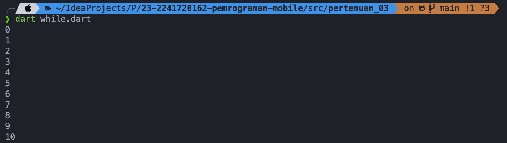

# Pemrograman Mobile - Pertemuan 3

<table>
    <thead>
        <th style="text-align: center;" colspan="2">Pertemuan 3</th>
    </thead>
    <tbody>
        <tr>
            <td>Nama</td>
            <td>Ridho Aulia' Rahman</td>
        </tr>
        <tr>
            <td>Nim</td>
            <td>2241720162</td>
        </tr>
    </tbody>
</table>

# Praktikum 1: Menerapkan Control Flows ("if/else")

**Langkah 1**

Kode:

**Langkah 2**

Silakan coba eksekusi (Run) kode pada langkah 1 tersebut. Apa yang terjadi? Jelaskan!

Output:

Variabel `test` dinisialisasi dengan nilai `"test2"`. Dari baris 3 - 11 Dark akan melakukan pemeriksaan dengan membandingkan nilai dan tipe data yang sama di setiap blok if else. 
Program mencetak "Test2" dari blok else if pertama.
Program juga mencetak "Test2 again" karena ada pengecekan lagi pada blok if kedua yang juga true.

**Langkah 3**

Kode:

Sebelum kode diubah terdapat error karena variabel `test` sudah di definisikan dan terdapat error pada block if karena tidak ada tanda `==` untuk membandingkan nilai.

Setelah di perbaiki kode tersebut akan mencetak `"Kebenaran"` karena nilai variabel `test` adalah `"true"`.

# Praktikum 2: Menerapkan Perulangan "while" dan "do-while"

**Langkah 1**

Kode:

**Langkah 2**

Menjalankan kode

Kode diatas akan mencetak angka 0 sampai 32 karena perulangan `while` akan terus berjalan selama kondisi `counter < 3` bernilai `true`.

**Langkah 3**

Menambahkan kode berikut dan menjalankan ulang

Kode yang ditambahkan akan mencetak angka 33 sampai 76 karena perulangan `do-while` akan terus berjalan selama kondisi `counter < 77` bernilai `true`.

# Praktikum 3: Menerapkan Perulangan "for" dan "break-continue"

**Langkah 1**

Kode:

**Langkah 2**

Menjalankan kode, output:

Kode diatas akan mencetak angka 10 sampai 26 karena perulangan `for` akan terus berjalan selama kondisi `index < 27` bernilai `

**Langkah 3**

Menambahkan kode dan menjalankan ulang

Hasil dari kode diatas adalah kosong, karena pada block `else if` akan selalu bernilai true maka `continue;` akan selalu dijalankan dan tidak akan mencetak apapun dan jika mencapai `index` `21` program akan berhenti karena `break;`.

# Tugas Praktikum

Buatlah sebuah program yang dapat menampilkan bilangan prima dari angka 0 sampai 201 menggunakan Dart. Ketika bilangan prima ditemukan, maka tampilkan nama lengkap dan NIM Anda.

Output :

