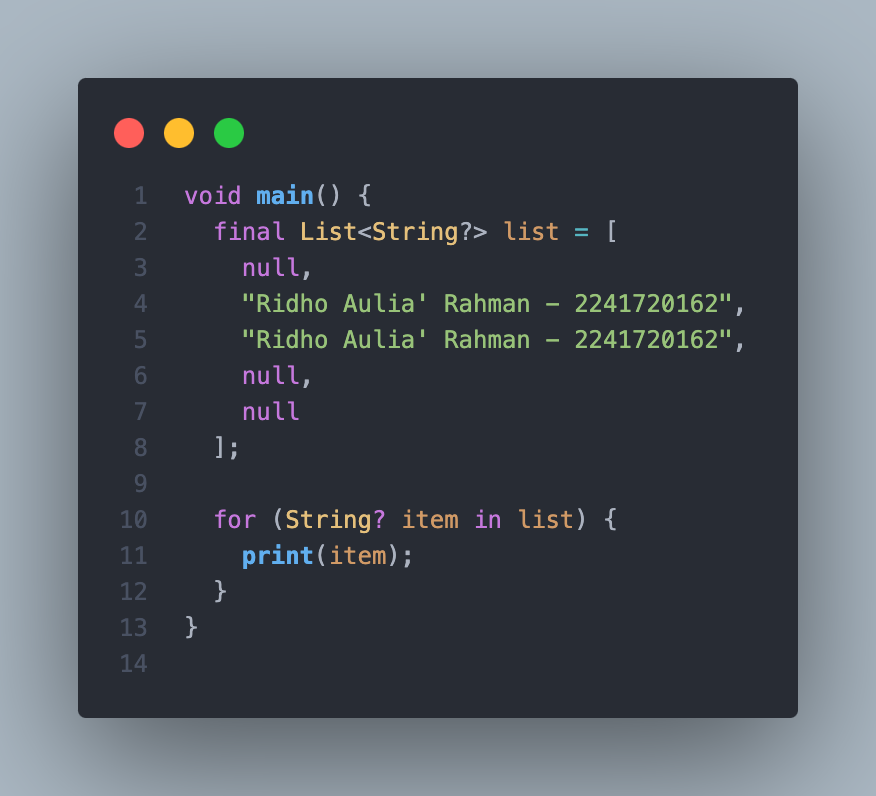
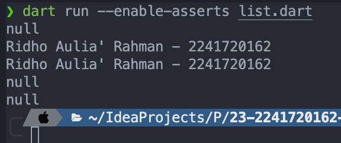
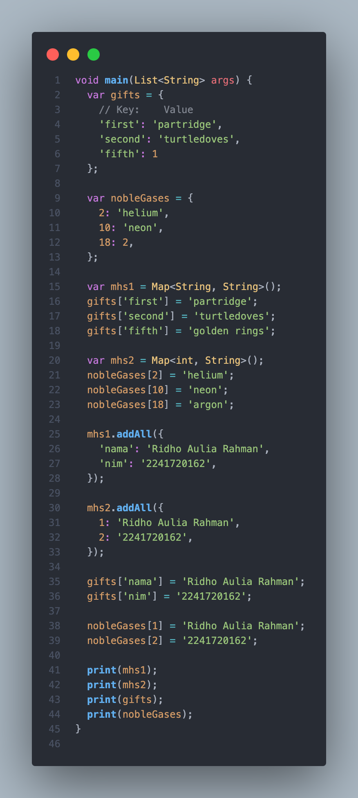
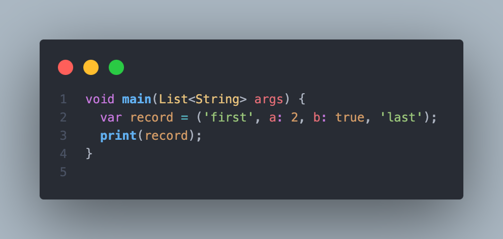

# Pemrograman Mobile - Pertemuan 4

<table>
    <thead>
        <th style="text-align: center;" colspan="2">Pertemuan 4</th>
    </thead>
    <tbody>
        <tr>
            <td>Nama</td>
            <td>Ridho Aulia' Rahman</td>
        </tr>
        <tr>
            <td>Nim</td>
            <td>2241720162</td>
        </tr>
    </tbody>
</table>

# Praktikum 1: Praktikum 1: Eksperimen Tipe Data List

**Langkah 1**

Kode:


**Langkah 2**

Silakan coba eksekusi (Run) kode pada langkah 1 tersebut. Apa yang terjadi? Jelaskan!

Output:


Jawab:

Dari kode diatas menampilkan length dari list yang berisi 3, menampilkan data di index ke 1, merubah data di index ke 1 menjadi 1 dan menampilkan data index ke 1. 

**Langkah 3**

Ubah kode pada langkah 1 menjadi variabel final yang mempunyai index = 5 dengan default value = null. Isilah nama dan NIM Anda pada elemen index ke-1 dan ke-2. Lalu print dan capture hasilnya.

Kode:



Output:



# Praktikum 2: Eksperimen Tipe Data Set

**Langkah 1**

Kode:


**Langkah 2**

Output:


**Langkah 3**

Kode:


Output:


# Praktikum 3: Eksperimen Tipe Data Maps

**Langkah 1**

Kode:


**Langkah 2**

Output:


**Langkah 3**

Tambahkan elemen nama dan NIM Anda pada tiap variabel di atas (gifts, nobleGases, mhs1, dan mhs2). Dokumentasikan hasilnya dan buat laporannya!

Kode:



Output:


# Praktikum 4: Eksperimen Tipe Data List: Spread dan Control-flow Operators

**Langkah 1**

Kode:


**Langkah 2**

Output:


**Langkah 3**

Tambahkan variabel list berisi NIM Anda menggunakan Spread Operators. Dokumentasikan hasilnya dan buat laporannya!

Kode:


Output:


**Langkah 4**

Tunjukkan hasilnya jika variabel promoActive ketika true dan false.

Kode:


Output:


**Langkah 5**

Tunjukkan hasilnya jika variabel login mempunyai kondisi lain.

Kode:


Output:


**Langkah 6**

Jelaskan manfaat Collection For dan dokumentasikan hasilnya.

Kode:


Output:


Jawab:

Collection For digunakan untuk melakukan iterasi pada list, set, map, dll. Dengan menggunakan collection for, kita bisa melakukan iterasi pada list, set, map, dll dengan lebih mudah dan efisien.

# Praktikum 5: Eksperimen Tipe Data Records

**Langkah 1**

Kode:



**Langkah 2**

Output:


**Langkah 3**

Kode:


Output:


**Langkah 4**

Kode:


Output:


**Langkah 5**

Kode:


Output:


# Tugas Praktikum

1. Silakan selesaikan Praktikum 1 sampai 5, lalu dokumentasikan berupa screenshot hasil pekerjaan Anda beserta penjelasannya!
2. Jelaskan yang dimaksud Functions dalam bahasa Dart!
3. Jelaskan jenis-jenis parameter di Functions beserta contoh sintaksnya!
4. Jelaskan maksud Functions sebagai first-class objects beserta contoh sintaknya!
5. Apa itu Anonymous Functions? Jelaskan dan berikan contohnya!
6. Jelaskan perbedaan Lexical scope dan Lexical closures! Berikan contohnya!
7. Jelaskan dengan contoh cara membuat return multiple value di Functions!
8. Kumpulkan berupa link commit repo GitHub pada tautan yang telah disediakan di grup Telegram!

Jawab:

1. Sudah dijelaskan pada bagian sebelumnya.

2. Functions dalam bahasa Dart adalah sebuah blok kode yang berfungsi untuk melakukan tugas tertentu. Functions dapat digunakan untuk mengelompokkan kode agar lebih mudah dibaca dan dikelola.

3. Jenis-jenis parameter di Functions:
    - Required Parameters: Parameter yang harus diisi ketika memanggil fungsi.
    - Optional Parameters: Parameter yang tidak harus diisi ketika memanggil fungsi.
    - Default Parameters: Parameter yang memiliki nilai default.
    - Named Parameters: Parameter yang memiliki nama.

    Contoh sintaksnya:
    ```dart
    void main() {
        // Required Parameters
        void sayHello(String name) {
            print('Hello $name');
        }

        sayHello('Ridho');

        // Optional Parameters
        void sayHelloOptional(String name, [String? greeting]) {
            print('$greeting $name');
        }

        sayHelloOptional('Ridho', 'Hello');

        // Default Parameters
        void sayHelloDefault(String name, [String greeting = 'Hello']) {
            print('$greeting $name');
        }

        sayHelloDefault('Ridho');

        // Named Parameters
        void sayHelloNamed({String? name, String? greeting}) {
            print('$greeting $name');
        }

        sayHelloNamed(name: 'Ridho', greeting: 'Hello');
    }
    ```

4. Functions sebagai first-class objects adalah sebuah konsep dimana fungsi dapat digunakan sebagai nilai. Fungsi dapat disimpan dalam variabel, dikirimkan sebagai parameter ke fungsi lain, dan dikembalikan dari fungsi lain.
    
    Contoh sintaksnya:
    
    ```dart
   // Fungsi sebagai first-class objects

    // Fungsi dapat disimpan dalam variabel
    String greet(String name) {
        return 'Hello, $name!';
    }

    void main() {
        // Menyimpan fungsi dalam variabel
        var greeting = greet;
        print(greeting('Alice')); // Output: Hello, Alice!

        // Fungsi dapat diteruskan sebagai argumen
        void callFunction(String Function(String) func, String name) {
            print(func(name));
        }

        callFunction(greet, 'Bob'); // Output: Hello, Bob!

        // Fungsi dapat dikembalikan dari fungsi lain
        String Function(String) getGreetingFunction() {
            return greet;
        }

        var newGreet = getGreetingFunction();
        print(newGreet('Charlie')); // Output: Hello, Charlie!
    }
    ```

5. Anonymous Functions adalah fungsi yang tidak memiliki nama. Anonymous Functions biasanya digunakan ketika kita hanya membutuhkan fungsi tersebut sekali saja.
    
    Contoh sintaksnya:
    
    ```dart
    void main() {
        // Fungsi anonim menggunakan lambda
        var add = (int x, int y) => x + y;
        print(add(2, 3));  // Output: 5

        // Menggunakan fungsi anonim sebagai argumen
        var numbers = [1, 2, 3, 4, 5];
        var squared = numbers.map((x) => x * x).toList();
        print(squared);  // Output: [1, 4, 9, 16, 25]
    }
    ```

6. Lexical scope adalah konsep dimana sebuah variabel hanya dapat diakses di dalam blok kode dimana variabel tersebut dideklarasikan. Sedangkan Lexical closures adalah konsep dimana sebuah fungsi dapat mengakses variabel yang dideklarasikan di luar fungsi tersebut.

    Contoh Lexical scope:
    ```dart
    void main() {
        void outerFunction() {
            var outerVariable = 'I am outside!';

            void innerFunction() {
                print(outerVariable); // Bisa mengakses outerVariable
            }

            innerFunction();
        }

        void main() {
            outerFunction(); // Output: I am outside!
        }
    }
    ```

    Contoh Lexical closures:
    ```dart
    Function outerFunction() {
        var outerVariable = 'I am outside!';

        void innerFunction() {
            print(outerVariable); // Bisa mengakses outerVariable
        }

        return innerFunction;
    }

    void main() {
        var closureFunction = outerFunction();
        closureFunction(); // Output: I am outside!
    }
    ```

7. Cara membuat return multiple value di Functions adalah dengan menggunakan List atau Map.
    
    Contoh sintaksnya:
    ```dart
    void main() {
        List<int> sumAndProduct(int a, int b) {
            return [a + b, a * b];
        }

        var result = sumAndProduct(2, 3);
        print('Sum: ${result[0]}, Product: ${result[1]}');
    }
    ```