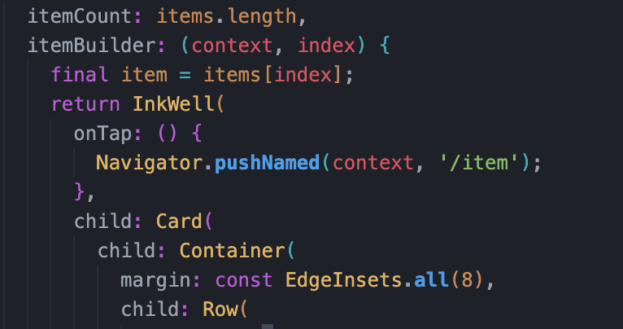
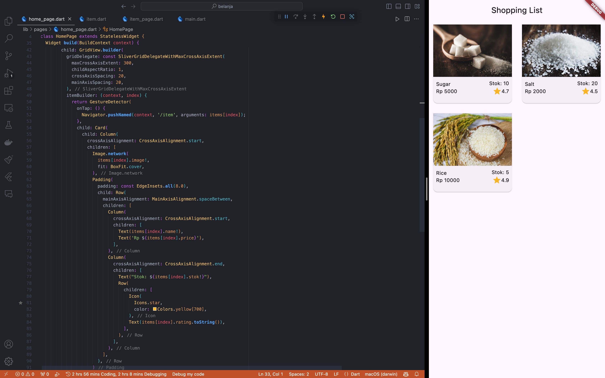
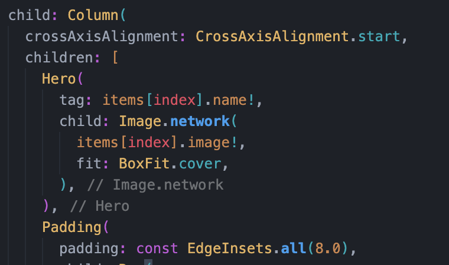
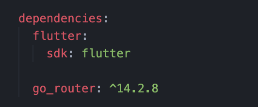

# Pemrograman Mobile - Pertemuan 6

<table>
    <thead>
        <th style="text-align: center;" colspan="2">Pertemuan 6</th>
    </thead>
    <tbody>
        <tr>
            <td>Nama</td>
            <td>Ridho Aulia' Rahman</td>
        </tr>
        <tr>
            <td>Nim</td>
            <td>2241720162</td>
        </tr>
    </tbody>
</table>

# Tugas Praktikum 1 
## 1. Selesaikan Praktikum 1 sampai 4.
## Praktikum 1: Membangun Layout di FLutter

**Langkah 1: Buat Project Baru**

Buatlah sebuah project flutter baru dengan nama layout_flutter.


**Langkah 2: Buka file lib/main.dart**

Buka file `main.dart` lalu ganti dengan kode berikut. Isi nama dan NIM Anda di `text title`.


**Langkah 4: Implementasi title row**

Tambahkan kode berikut di bagian atas metode build() di dalam kelas MyApp.

```dart
Widget titleSection = Container(
  padding: const EdgeInsets.all(...),
  child: Row(
    children: [
      Expanded(
        /* soal 1*/
        child: Column(
          crossAxisAlignment: ...,
          children: [
            /* soal 2*/
            Container(
              padding: const EdgeInsets.only(bottom: ...),
              child: const Text(
                'Wisata Gunung di Batu',
                style: TextStyle(
                  fontWeight: FontWeight.bold,
                ),
              ),
            ),
            Text(
              'Batu, Malang, Indonesia',
              style: TextStyle(...),
            ),
          ],
        ),
      ),
      /* soal 3*/
      Icon(
       ...,
        color: ...,
      ),
      const Text(...),
    ],
  ),
);
```

/* soal 1 */ Letakkan widget Column di dalam widget Expanded agar menyesuaikan ruang yang tersisa di dalam widget Row. Tambahkan properti crossAxisAlignment ke CrossAxisAlignment.start sehingga posisi kolom berada di awal baris.

/* soal 2 */ Letakkan baris pertama teks di dalam Container sehingga memungkinkan Anda untuk menambahkan padding = 8. Teks ‘Batu, Malang, Indonesia' di dalam Column, set warna menjadi abu-abu.

/* soal 3 */ Dua item terakhir di baris judul adalah ikon bintang, set dengan warna merah, dan teks "41". Seluruh baris ada di dalam Container dan beri padding di sepanjang setiap tepinya sebesar 32 piksel. Kemudian ganti isi body text ‘Hello World' dengan variabel titleSection seperti berikut:

Jawab :


## Praktikum 2: Implementasi button row

**Langkah 1: Buat method Column _buildButtonColumn**

Karena kode untuk membangun setiap kolom hampir sama, buatlah metode pembantu pribadi bernama buildButtonColumn(), yang mempunyai parameter warna, Icon dan Text, sehingga dapat mengembalikan kolom dengan widgetnya sesuai dengan warna tertentu.


**Langkah 2: Buat widget buttonSection**

Buat Fungsi untuk menambahkan ikon langsung ke kolom. Teks berada di dalam Container dengan margin hanya di bagian atas, yang memisahkan teks dari ikon.


**Langkah 3: Tambah button section ke body**


## Praktikum 3: Implementasi text section

**Langkah 1: Buat widget textSection**

Tentukan bagian teks sebagai variabel. Masukkan teks ke dalam Container dan tambahkan padding di sepanjang setiap tepinya. Tambahkan kode berikut tepat di bawah deklarasi buttonSection:


**Langkah 2: Tambahkan variabel text section ke body**


## Praktikum 4: Implementasi image section

**Langkah 1: Siapkan aset gambar**

Mencari gambar di internet yang ingin ditampilkan, lalu set nama file tersebut ke file pubspec.yaml


**Langkah 2: Tambahkan gambar ke body**


**Langkah 3: Terakhir, ubah menjadi ListView**

Pada langkah terakhir ini, atur semua elemen dalam ListView, bukan Column, karena ListView mendukung scroll yang dinamis saat aplikasi dijalankan pada perangkat yang resolusinya lebih kecil.


Jika konten tidak muat di layar, ListView akan menambahkan scroll secara otomatis.


## 2. Silakan implementasikan di project baru "basic_layout_flutter".

**Langkah 1: Buat Project Baru**

Membuat project baru dengan nama `basic_layout_flutter`.


**Langkah 2: Lakukan Slicing sesuai dengan instruksi pada gambar**


**Langkah 3: Membuat Layout**

Membentuk layout sesuai dengan gambar.


**Langkah 4: Isi konten pada Column petama**

Membuat custom Widget untuk menampilkan konten pada Column pertama.


Isi konten pada Column pertama.


**Langkah 5: Isi konten pada Column kedua**

Menyiapkan asset gambar yang akan digunakan.


Memasukkan asset gambar ke dalam folder assets. dan load gambar ke dalam aplikasi.


## Praktikum 5: Membangun Navigasi di Flutter

**Langkah 1: Siapkan Project Baru**

Membuat project baru dengan nama `belanja`


Menyiapkan struktur folder.


**Langkah 2: Mendefinisikan Route**

Membuat dua buah file dart dengan nama home_page.dart dan item_page.dart pada folder pages. Untuk masing-masing file,dideklarasikan class HomePage pada file home_page.dart dan ItemPage pada item_page.dart. Turunkan class dari StatelessWidget.


**Langkah 3: Lengkapi Kode di `main.dart`**

Setelah kedua halaman telah dibuat dan didefinisikan, file main.dart definisikan Route untuk kedua halaman tersebut. Definisi penamaan route harus bersifat unique. Halaman HomePage didefinisikan sebagai /. Dan halaman ItemPage didefinisikan sebagai /item. Untuk mendefinisikan halaman awal, dapat menggunakan named argument initialRoute.


**Langkah 4: Membuat data model**

Sebelum melakukan perpindahan halaman dari HomePage ke ItemPage, dibutuhkan proses pemodelan data. Pada desain mockup, dibutuhkan dua informasi yaitu nama dan harga. Untuk menangani hal ini, buatlah sebuah file dengan nama item.dart dan letakkan pada folder models.


**Langkah 5: Lengkapi kode di class `HomePage`**

Pada halaman HomePage terdapat ListView widget. Sumber data ListView diambil dari model List dari object Item.


**Langkah 6: Membuat ListView dan itemBuilder**

Untuk menampilkan ListView pada praktikum ini digunakan itemBuilder. Data diambil dari definisi model yang telah dibuat sebelumnya.

Kode beserta hasil running.


**Langkah 7: Menambahkan aksi pada `ListView`**

Untuk menambahkan aksi pada ListView dapat digunakan widget InkWell atau GestureDetector. Perbedaan utamanya InkWell merupakan material widget yang memberikan efek ketika ditekan. Sedangkan GestureDetector bersifat umum dan bisa juga digunakan untuk gesture lain selain sentuhan.



Sekarang jika item pada ListView ditekan, maka akan berpindah ke halaman ItemPage.


# Tugas Praktikum 2

1. Untuk melakukan pengiriman data ke halaman berikutnya, cukup menambahkan informasi arguments pada penggunaan Navigator. Perbarui kode pada bagian Navigator menjadi seperti berikut.
```dart
Navigator.pushNamed(context, ItemPage.routeName, arguments: item);
```


2. Pembacaan nilai yang dikirimkan pada halaman sebelumnya dapat dilakukan menggunakan ModalRoute. Tambahkan kode berikut pada blok fungsi build dalam halaman ItemPage. Setelah nilai didapatkan, anda dapat menggunakannya seperti penggunaan variabel pada umumnya.

```dart
final itemArgs = ModalRoute.of(context)!.settings.arguments as Item;
```


Jika berhasil, maka akan muncul data yang dikirimkan pada halaman sebelumnya.


3. Pada hasil akhir dari aplikasi belanja yang telah anda selesaikan, tambahkan atribut foto produk, stok, dan rating. Ubahlah tampilan menjadi GridView seperti di aplikasi marketplace pada umumnya.

Menambahkan atribut foto produk, stok, dan rating pada model Item.


Menambahkan foto, stok, dan rating pada list item.


Mengubah tampilan menjadi GridView.



4. Silakan implementasikan Hero widget pada aplikasi belanja Anda.

Menambahkan Hero widget pada item list di HomePage.



Menambahkan Hero widget pada ItemPage.


Jika berhasil, maka akan muncul animasi Hero widget.


5. Sesuaikan dan modifikasi tampilan sehingga menjadi aplikasi yang menarik. Selain itu, pecah widget menjadi kode yang lebih kecil. Tambahkan Nama dan NIM di footer aplikasi belanja Anda.

Memecah widget menjadi 3 component, yaitu ItemImage,ItemCard, dan ItemDetails.


Berikut detail kode:


Ubah home_page.dart menjadi seperti berikut:


Ubah item_page.dart menjadi seperti berikut:


Hasil:


6. Selesaikan Praktikum 5: Navigasi dan Rute tersebut. Cobalah modifikasi menggunakan plugin go_router.

Menambahkan go_router pada pubspec.yaml.



Konfigurasi go_router di file main.dart.


Menggunakan go_router pada ItemCard.


Menerapkan go_router pada ItemPage.


Hasil:


