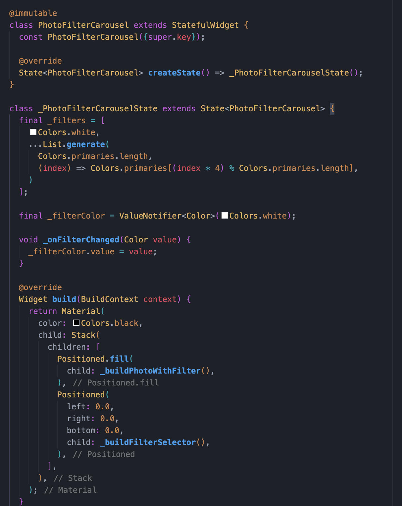

# Pemrograman Mobile - Pertemuan 6

<table>
    <thead>
        <th style="text-align: center;" colspan="2">Pertemuan 9</th>
    </thead>
    <tbody>
        <tr>
            <td>Nama</td>
            <td>Ridho Aulia' Rahman</td>
        </tr>
        <tr>
            <td>Nim</td>
            <td>2241720162</td>
        </tr>
    </tbody>
</table>

# Tugas Praktikum
1. Selesaikan Praktikum 1 dan 2, lalu dokumentasikan dan push ke repository Anda berupa screenshot setiap hasil pekerjaan beserta penjelasannya di file README.md! Jika terdapat error atau kode yang tidak dapat berjalan, silakan Anda perbaiki sesuai tujuan aplikasi dibuat!
2. Gabungkan hasil praktikum 1 dengan hasil praktikum 2 sehingga setelah melakukan pengambilan foto, dapat dibuat filter carouselnya!
3. Jelaskan maksud void async pada praktikum 1?
4. Jelaskan fungsi dari anotasi @immutable dan @override ?

# Jawaban

## 1. Praktikum 1: Mengambil Foto dengan Kamera di Flutter

**Langkah 1: Buat Project Baru**

Membuat project baru dengan nama `kamera_flutter`

**Langkah 2: Tambah dependensi yang diperlukan**

Menambahkan 3 dependensi yang diperlukan yaitu `camera`, `path_provider`, dan `path`.

Meningkatkan minSdkVersion menjadi 21

**Langkah 3: Ambil Sensor Kamera dari device**

Cek jumlah kamera yang tersedia di device

**Langkah 4: Buat dan inisialisasi `CameraController`**

**Langkah 5: Gunakan `CameraPreview` untuk menampilkan preview foto**

Gunakan widget `CameraPreview` dari package camera untuk menampilkan preview foto

**Langkah 6: Ambil foto dengan `CameraController`**

Menggunakan CameraController untuk mengambil gambar menggunakan metode takePicture()

**Langkah 7: Buat widget baru `DisplayPictureScreen`**

Buat file baru pada folder widget display_picture_screen.dart

**Langkah 8: Edit main.dart**

Edit pada file ini bagian `runApp`

**Langkah 9: Menampilkan hasil foto**

Menambahkan kode pada bagian try / catch agar dapat menampilkan hasil foto pada DisplayPictureScreen.

**Hasil**

## 2. Praktikum 2 : Membuat photo filter carousel

**Langkah 1: Buat project baru**

Membuat project flutter baru di pertemuan 09 dengan nama `photo_filter_carousel`

**Langkah 2: Buat widget Selector ring dan dark gradient**

Membuat widget baru `filter_selector`

**Langkah 3: Buat widget photo filter carousel**

Membuat widget baru `filter_carousel`

**Langkah 4: Membuat filter warna - bagian 1**

Membuat widget baru `carousel_flowdelegate`

**Langkah 5: Membuat filter warna**

Membuat widget baru `filter_item`

**Langkah 6: Implementasi filter carousel**

Menggunakan widget `filter_carousel` pada `main.dart`

**Hasil**

## Gabungkan hasil praktikum 1 dengan hasil praktikum 2 sehingga setelah melakukan pengambilan foto, dapat dibuat filter carouselnya!

Memasukkan file hasil praktikum 2 ke dalam praktikum 1

Menambahkan parameter `imagePath` pada `PhotoFilterCarousel`

Menambahkan `PhotoFilterCarousel` pada `DisplayPictureScreen`

**Hasil**

## Jelaskan maksud void async pada praktikum 1?

`void async` digunakan untuk membuat fungsi menjadi asynchronous. Fungsi asynchronous adalah fungsi yang dapat berjalan secara bersamaan dengan fungsi lainnya. Dengan kata lain, fungsi tersebut tidak akan menunggu proses yang sedang berjalan selesai terlebih dahulu.

## Jelaskan fungsi dari anotasi @immutable dan @override ?

`@immutable` digunakan untuk membuat class menjadi immutable, artinya class tersebut tidak dapat diubah setelah dibuat. Immutable class adalah class yang tidak dapat diubah setelah dibuat. Immutable class tidak memiliki setter dan tidak dapat diubah nilainya.

`@override` digunakan untuk menandakan bahwa method yang dideklarasikan pada class tersebut merupakan method yang diwarisi dari superclass. Dengan kata lain, method tersebut diwarisi dari superclass dan di-override pada class tersebut.