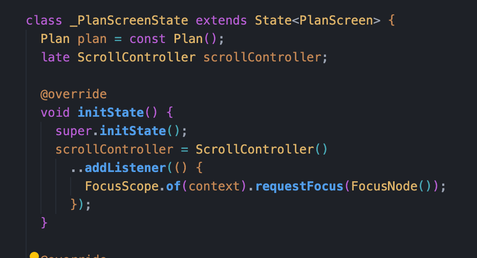
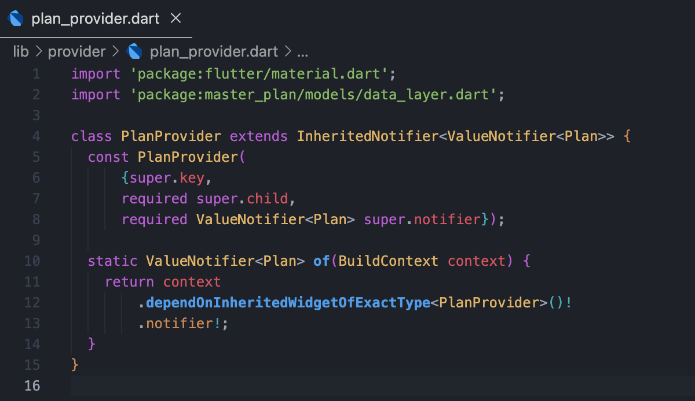
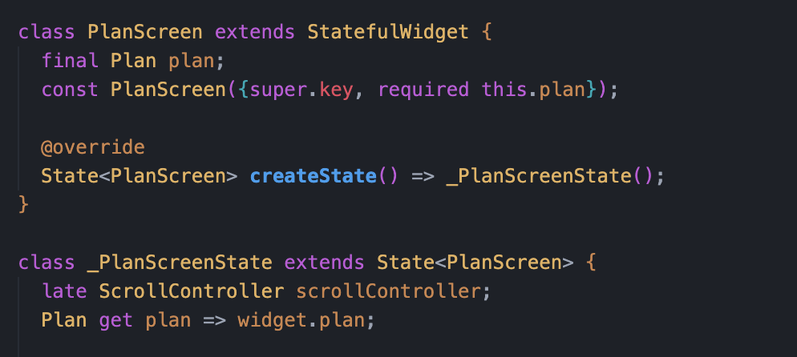
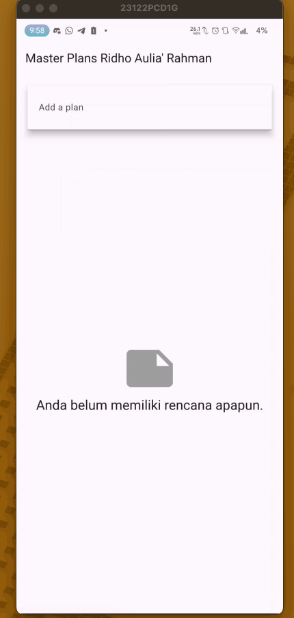
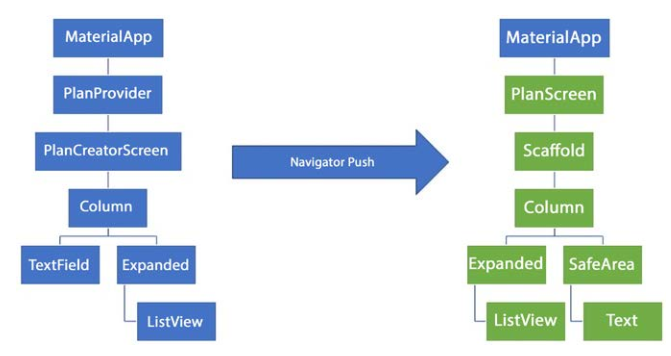

# Pemrograman Mobile - Pertemuan 10

<table>
    <thead>
        <th style="text-align: center;" colspan="2">Pertemuan 10</th>
    </thead>
    <tbody>
        <tr>
            <td>Nama</td>
            <td>Ridho Aulia' Rahman</td>
        </tr>
        <tr>
            <td>Nim</td>
            <td>2241720162</td>
        </tr>
    </tbody>
</table>

# Praktikum 1: Dasar State dengan Model-View

## Langkah 1: Buat Project Baru

Membuat project flutter baru dengan nama `master_plan` dan menambahkan folder models dan views.

## Langkah 2: Membuat model `task.dart`

Membuat file bernama task.dart dan buat class Task. Class ini memiliki atribut description dengan tipe data String dan complete dengan tipe data Boolean.

## Langkah 3: Buat file plan.dart

Membuat file plan.dart untuk menyimpan daftar rencana dalam aplikasi to-do.

## Langkah 4: Buat file `data_layer.dart`

Membuat file data_layer.dart untuk menyimpan data yang akan digunakan dalam aplikasi. untuk membungkus beberapa data layer ke dalam sebuah file yang nanti akan mengekspor kedua model tersebut

## Langkah 5: Pindah ke file main.dart

Mengubah isi `main.dart`

## Langkah 6: buat plan_screen.dart

Membuat sebuah file plan_screen.dart pada folder views,  dan gunakan template StatefulWidget untuk membuat class PlanScreen

## Langkah 7: buat method _buildAddTaskButton()

Membuat method _buildAddTaskButton() untuk membuat tombol tambah task

## Langkah 8: buat widget _buildList()

Membuat widget _buildList() untuk membuat list task

## Langkah 9: buat widget _buildTaskTile

Membuat widget _buildTaskTile untuk membuat tile task

## Langkah 10: Tambah Scroll Controller

Pada file plan_screen.dart, tambahkan variabel scroll controller di class State tepat setelah variabel plan

## Langkah 11: Tambah Scroll Listener

Tambahkan method initState() setelah deklarasi variabel scrollController

## Langkah 12: Tambah controller dan keyboard behavior

Tambahkan controller dan keyboard behavior pada ListView di method _buildList.

## Langkah 13: Terakhir, tambah method dispose()

Tambahkan method dispose() di class PlanScreenState untuk membersihkan scroll controller

## Hasil

# Tugas Praktikum 1: Dasar State dengan Model-View
1. Selesaikan langkah-langkah praktikum tersebut, lalu dokumentasikan berupa GIF hasil akhir praktikum beserta penjelasannya di file README.md! Jika Anda menemukan ada yang error atau tidak berjalan dengan baik, silakan diperbaiki.
2. Jelaskan maksud dari langkah 4 pada praktikum tersebut! Mengapa dilakukan demikian?
3. Mengapa perlu variabel plan di langkah 6 pada praktikum tersebut? Mengapa dibuat konstanta ?
4. Lakukan capture hasil dari Langkah 9 berupa GIF, kemudian jelaskan apa yang telah Anda buat!
5. Apa kegunaan method pada Langkah 11 dan 13 dalam lifecyle state ?

## Jawaban

2. Langkah 4 pada praktikum tersebut dilakukan untuk membungkus beberapa data layer ke dalam sebuah file yang nanti akan mengekspor kedua model tersebut.

3. Variabel plan pada langkah 6 digunakan untuk menyimpan data yang akan digunakan dalam aplikasi. Variabel plan dibuat konstanta agar data yang disimpan tidak dapat diubah.

4. Saya membuat widget _buildTaskTile untuk membuat tile task.

5. Method pada langkah 11 digunakan untuk menambahkan listener pada scroll controller, sedangkan method pada langkah 13 digunakan untuk membersihkan scroll controller.

# Praktikum 2: Mengelola Data Layer dengan InheritedWidget dan InheritedNotifier

## Langkah 1: Buat file plan_provider.dart

Membuat folder providers dan file plan_provider.dart. File ini akan berisi class PlanProvider yang meng-extend dari ChangeNotifier.

## Langkah 2: Edit main.dart

Mengubah main.dart

## Langkah 3: Tambah method pada model plan.dart

Menambahkan method completedCount dan completenessMessage pada class Plan.

## Langkah 4: Pindah ke PlanScreen

Hapus deklarasi variabel plan

## Langkah 5: Edit method _buildAddTaskButton

Tambahkan BuildContext sebagai parameter dan gunakan PlanProvider sebagai sumber datanya.

## Langkah 6: Edit method _buildTaskTile

Tambahkan parameter BuildContext, gunakan PlanProvider sebagai sumber data. Ganti TextField menjadi TextFormField untuk membuat inisial data provider menjadi lebih mudah.

## Langkah 7: Edit _buildList

Sesuaikan parameter pada bagian _buildTaskTile

## Langkah 8: Tetap di class PlanScreen

Edit method build sehingga bisa tampil progress pada bagian bawah (footer).

## Langkah 9: Tambah widget SafeArea

Tambahkan widget SafeArea pada method build

## Hasil

# Tugas Praktikum 2: InheritedWidget

1. Selesaikan langkah-langkah praktikum tersebut, lalu dokumentasikan berupa GIF hasil akhir praktikum beserta penjelasannya di file README.md! Jika Anda menemukan ada yang error atau tidak berjalan dengan baik, silakan diperbaiki sesuai dengan tujuan aplikasi tersebut dibuat.
2. Jelaskan mana yang dimaksud InheritedWidget pada langkah 1 tersebut! Mengapa yang digunakan InheritedNotifier?
3. Jelaskan maksud dari method di langkah 3 pada praktikum tersebut! Mengapa dilakukan demikian?
4. Lakukan capture hasil dari Langkah 9 berupa GIF, kemudian jelaskan apa yang telah Anda buat!

## Jawaban

2. InheritedWidget pada langkah 1 digunakan untuk membagikan data ke dalam widget-tree. InheritedNotifier digunakan karena InheritedNotifier adalah turunan dari InheritedWidget yang memiliki kemampuan untuk memberitahukan widget yang menggunakan data tersebut untuk melakukan rebuild ketika data berubah.

3. Method pada langkah 3 digunakan untuk menghitung jumlah task yang sudah selesai dan menampilkan pesan berdasarkan jumlah task yang sudah selesai.

4. Saya menambahkan widget SafeArea pada method build. SafeArea digunakan untuk memberikan padding pada aplikasi agar tidak terlalu dekat dengan tepi layar.

# Praktikum 3: Membuat State di Multiple Screens

## Langkah 1: Edit PlanProvider

Edit class PlanProvider sehingga dapat menangani List Plan.

## Langkah 2: Edit main.dart

Mengubah main.dart

## Langkah 3: Edit plan_screen.dart

Tambahkan variabel plan dan atribut pada constructor-nya.

## Langkah 4: Error

Akan terjadi error setiap kali memanggil PlanProvider.of(context). Itu terjadi karena screen saat ini hanya menerima tugas-tugas untuk satu kelompok Plan, tapi sekarang PlanProvider menjadi list dari objek plan tersebut.

## Langkah 5: Tambah getter Plan

Tambahkan getter pada `_PlanScreenState`

## Langkah 6: Method initState()

## Langkah 7: Widget build

Merubah ke List dan mengubah nilai pada currentPlan.

## Langkah 8: Edit _buildTaskTile

Ubah ke List dan variabel planNotifier

## Langkah 9: Buat screen baru

Membuat file baru dengan nama plan_creator_screen.dart di folder view,  dan deklarasikan dengan StatefulWidget bernama PlanCreatorScreen

## Langkah 10: Pindah ke class _PlanCreatorScreenState

Menambahkab variabel TextEditingController sehingga bisa membuat TextField sederhana untuk menambah Plan baru dan menambahkan dispose ketika widget unmounted

## Langkah 11: Pindah ke method build

Menambahkan Widget Scaffold

## Langkah 12: Buat widget _buildListCreator

Membuat widget _buildListCreator

## Langkah 13: Buat void addPlan()

Membuat void addPlan() untuk menambahkan Plan baru

## Langkah 14: Buat widget _buildMasterPlans()

Membuat widget _buildMasterPlans

## Hasil

# Tugas Praktikum 3: State di Multiple Screens

1. Selesaikan langkah-langkah praktikum tersebut, lalu dokumentasikan berupa GIF hasil akhir praktikum beserta penjelasannya di file README.md! Jika Anda menemukan ada yang error atau tidak berjalan dengan baik, silakan diperbaiki sesuai dengan tujuan aplikasi tersebut dibuat.
2. Berdasarkan Praktikum 3 yang telah Anda lakukan, jelaskan maksud dari gambar diagram berikut ini!

3. Lakukan capture hasil dari Langkah 14 berupa GIF, kemudian jelaskan apa yang telah Anda buat!

## Jawaban

2. Navigator.push digunakan untuk memindahkan pengguna dari PlanCreatorScreen (kiri) ke PlanScreen (kanan).
Perpindahan ini mengubah tampilan dari layar input menjadi tampilan daftar atau detail rencana.

3. Saya membuat widget _buildMasterPlans untuk membuat list rencana yang sudah dibuat.

