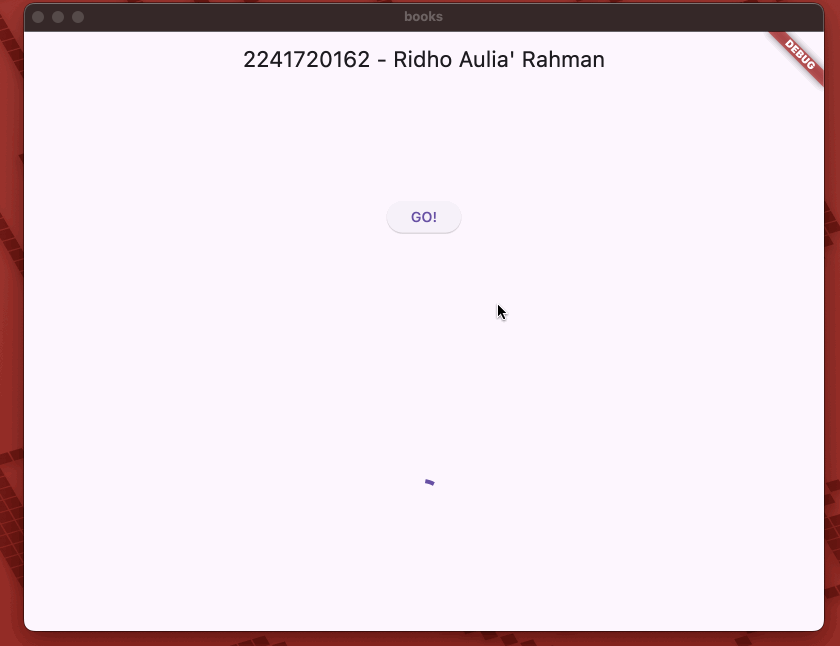
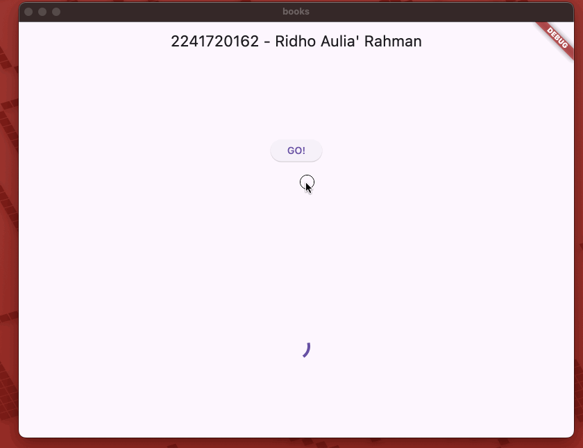
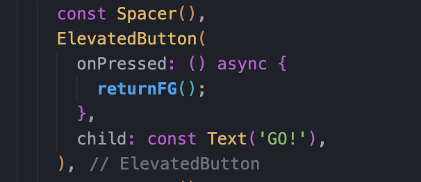
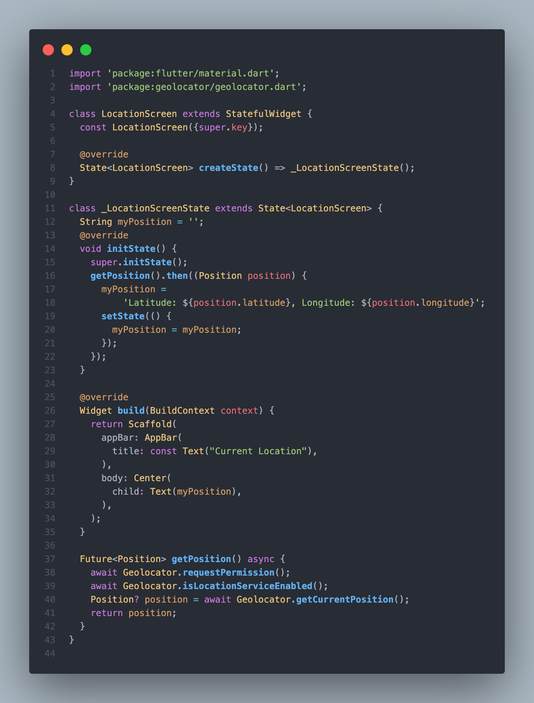
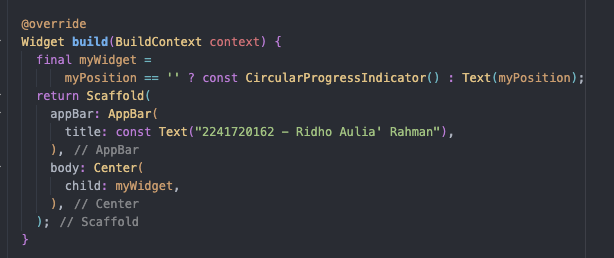
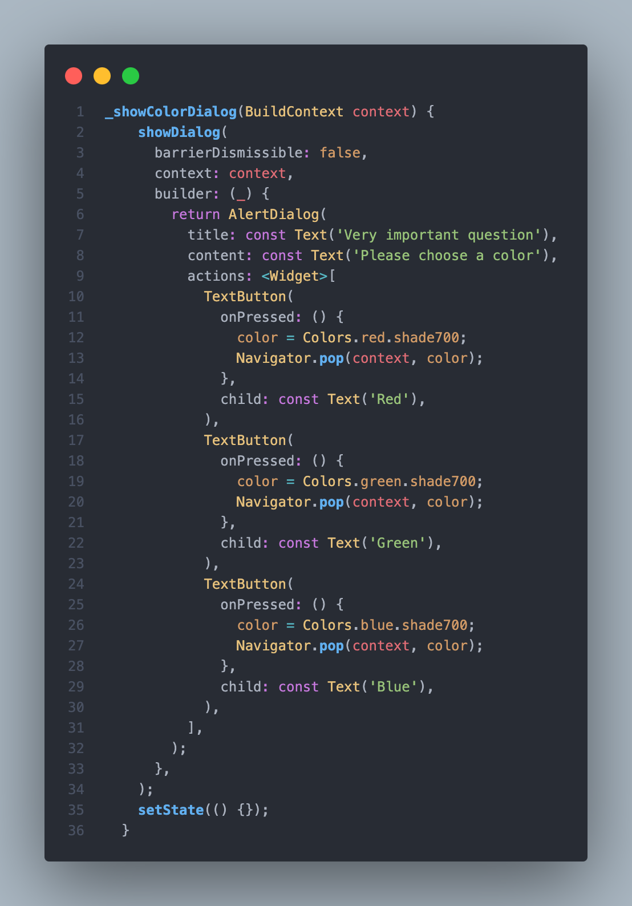

# Pemrograman Mobile - Pertemuan 11

<table>
    <thead>
        <th style="text-align: center;" colspan="2">Pertemuan 11</th>
    </thead>
    <tbody>
        <tr>
            <td>Nama</td>
            <td>Ridho Aulia' Rahman</td>
        </tr>
        <tr>
            <td>Nim</td>
            <td>2241720162</td>
        </tr>
    </tbody>
</table>

## Praktikum 1: Mengunduh Data dari Web Service (API)

### Langkah 1: Membuat Project Baru

Membuat project baru dengan nama `books` dan menambahkan dependencies `http`.

### Langkah 2: Cek file pubspec.yaml

Memastikan file `pubspec.yaml` sudah terdapat dependencies `http`.

Mengaktifkan internet karena menggunakan MacOS.

### Langkah 3: Buka file main.dart

### Soal 1
Tambahkan nama panggilan Anda pada title app sebagai identitas hasil pekerjaan Anda.

# Langkah 4: Tambah method getData()

Menambahkan method `getData()` untuk mengambil data dari web service.

## Soal 2

Carilah judul buku favorit Anda di Google Books, lalu ganti ID buku pada variabel path di kode tersebut.

# Langkah 5: Tambah kode di ElevatedButton

Menambahkan kode untuk memanggil method `getData()` pada ElevatedButton.

## Soal 3

Jelaskan maksud kode langkah 5 tersebut terkait `substring` dan `catchError`!

Capture hasil praktikum Anda berupa GIF dan lampirkan di README.

### Jawaban
`substring` digunakan untuk mengambil data dari index tertentu pada string. `catchError` digunakan untuk menangkap error yang terjadi pada kode.

## Praktikum 2: Menggunakan await/async untuk menghindari callbacks

### Langkah 1: Buka file main.dart

Menambahkan tiga method di dalam class _FuturePageState.

### Langkah 2: Tambah method count()

Menambahkan method `count()` untuk menghitung.

### Langkah 3: Panggil count()

Menambahkan kode untuk memanggil method `count()` pada ElevatedButton.

### Langkah 4: Run

Menjalankan aplikasi.

## Soal 4
Jelaskan maksud kode langkah 1 dan 2 tersebut!

Capture hasil praktikum Anda berupa GIF dan lampirkan di README. Lalu lakukan commit dengan pesan "W12: Soal 4".

### Jawaban

Kode langkah 1 adalah kode yang akan mengembalikan nilai 1,2,3 dengan delay 3 detik. Kode langkah 2 adalah kode yang akan menjalankan kode langkah 1 dan menampilkan hasilnya.

## Praktikum 3: Menggunakan Completer di Future

### Langkah 1: Buka main.dart

Melakukan import package async.

### Langkah 2: Tambahkan variabel dan method

Menambahkan variabel late dan method di class _FuturePageState.

### Langkah 3: Ganti isi kode onPressed()

Mengganti isi kode onPressed() pada ElevatedButton.

### Langkah 4: Run

## Soal 5

Jelaskan maksud kode langkah 2 tersebut!

Capture hasil praktikum Anda berupa GIF dan lampirkan di README.

### Jawaban

Kode tersebut menggunakan Completer untuk mengelola penyelesaian (completion) dari sebuah Future secara manual.

Mendeklarasikan variabel completer dengan keyword late, yang berarti variabel akan diinisialisasi nanti sebelum digunakan.

Fungsi `getNumber()` membuat instance baru dari `Completer<int>()`.
Memanggil fungsi `calculate()` yang akan menyelesaikan Completer tersebut.
Mengembalikan `completer.future`, yaitu sebuah Future yang akan berisi nilai ketika completer selesai (complete).

### Langkah 5: Ganti method calculate()

Mengganti atau membuat calculate2().

### Langkah 6: Pindah ke onPressed()

Mengganti isi kode onPressed() pada ElevatedButton.

## Soal 6
Jelaskan maksud perbedaan kode langkah 2 dengan langkah 5-6 tersebut!

Capture hasil praktikum Anda berupa GIF dan lampirkan di README. 

### Jawaban

Kode langkah 2 menggunakan Completer untuk mengelola penyelesaian (completion) dari sebuah Future secara manual tanpa melakukan handle jika terjadi error. 

Sedangkan kode langkah 5-6 menggunakan Completer dengan Future.delayed untuk menunda eksekusi kode selama 5 detik dan menerapkan try-catch untuk menangkap error yang terjadi dan completer.completeError() untuk menyelesaikan Completer dengan error.

## Praktikum 4: Memanggil Future secara paralel

### Langkah 1: Buka file main.dart

Menambahkan method returnFG ke dalam class _FuturePageState.

### Langkah 2: Edit onPressed()

Mengedit kode onPressed() pada ElevatedButton.

### Langkah 3: Run

Hasilnya dalam 3 detik berupa angka 6 lebih cepat dibandingkan praktikum sebelumnya menunggu sampai 9 detik.

## Soal 7

Capture hasil praktikum Anda berupa GIF dan lampirkan di README

### Jawaban

### Langkah 4: Ganti variabel futureGroup

Mengganti variabel futureGroup dengan `Future.wait`.

## Soal 8

Jelaskan maksud perbedaan kode langkah 1 dan 4!

### Jawaban

Kode langkah 1 menggunakan FutureGroup untuk mengelola beberapa Future secara paralel. Sedangkan kode langkah 4 menggunakan Future.wait untuk menjalankan beberapa Future secara paralel dan mengembalikan Future yang akan menyelesaikan ketika semua Future selesai.

Keduanya digunakan untuk menunggu beberapa Future selesai, tetapi FutureGroup memberikan fleksibilitas lebih dalam menambahkan Future secara dinamis

## Praktikum 5: Menangani Respon Error pada Async Code

### Langkah 1: Buka file main.dart

Menambahkan method `returnError` ke dalam class _FuturePageState.

### Langkah 2: ElevatedButton

Ubah kode onPressed() pada ElevatedButton.

### Langkah 3: Run

Menjalankan aplikasi.

## Soal 9

Capture hasil praktikum Anda berupa GIF dan lampirkan di README.

### Jawaban

### Langkah 4: Tambah method handleError()

Menambahkan method `handleError` ke dalam class _FuturePageState.

## Soal 10

Panggil method handleError() tersebut di ElevatedButton, lalu run. Apa hasilnya? Jelaskan perbedaan kode langkah 1 dan 4!

## Jawaban

Hasilnya akan menampilkan `complete` pada console. Perbedaan kode langkah 1 dan 4 adalah kode langkah 1 menggunakan catchError untuk menangkap error yang terjadi pada kode dan onComplete untuk menampilkan hasilnya di console. Sedangkan kode langkah 4 menggunakan try-catch pada method `returnError` untuk menangkap error yang terjadi dan menggunakan finally untuk menampilkan hasilnya di console.

## Praktikum 6: Menggunakan Future dengan StatefulWidget

### Langkah 1: install plugin geolocator

Menambahkan dependencies geolocator.

### Langkah 2: Tambah permission GPS

Menambahkan permission GPS.

### Langkah 3: Buat file geolocation.dart

Membuat file geolocation.dart.

### Langkah 4: Buat StatefulWidget

Buat class LocationScreen di dalam file geolocation.dart.

### Langkah 5: Isi kode geolocation.dart

Isi kode di dalam class LocationScreen.

## Soal 11
Tambahkan nama panggilan Anda pada tiap properti title sebagai identitas pekerjaan Anda.

## Jawaban

### Langkah 6: Edit main.dart

Panggil screen baru tersebut di file main.dart.

### Langkah 7: Run

Menjalankan aplikasi.

### Langkah 8: Tambahkan animasi loading

Menambahkan animasi loading.

## Soal 12
Jika Anda tidak melihat animasi loading tampil, kemungkinan itu berjalan sangat cepat. Tambahkan delay pada method getPosition() dengan kode await Future.delayed(const Duration(seconds: 3));

Apakah Anda mendapatkan koordinat GPS ketika run di browser? Mengapa demikian?

Capture hasil praktikum Anda berupa GIF dan lampirkan di README.

## Jawaban

Menambahkan delay pada method getPosition() dengan kode `await Future.delayed(const Duration(seconds: 3));`.

Saya mendapatkan koordinat GPS ketika run di browser. Hal ini dikarenakan browser memiliki akses ke GPS sehingga dapat menampilkan koordinat GPS.

Hasil run di browser.

Hasil run di device.

## Praktikum 7: Manajemen Future dengan FutureBuilder

### Langkah 1: Modifikasi method getPosition()

Menambahkan kode `await Future.delayed(const Duration(seconds: 3));` pada method getPosition().

### Langkah 2: Tambah variabel

Menambahkan variabel position di class _LocationScreenState.

### Langkah 3: Tambah initState()

Set variabel position pada initState().

### Langkah 4: Edit method build()

Mengedit method build().

## Soal 13

Apakah ada perbedaan UI dengan praktikum sebelumnya? Mengapa demikian?

Capture hasil praktikum Anda berupa GIF dan lampirkan di README.

## Jawaban

Tidak, tidak ada perbedaan UI dengan praktikum sebelumnya. Hal ini dikarenakan menggunakan FutureBuilder yang akan menampilkan widget sesuai dengan status Future.

### Langkah 5: Tambah handling error

Menambahkan handling error.

## Soal 14
Apakah ada perbedaan UI dengan langkah sebelumnya? Mengapa demikian?

Capture hasil praktikum Anda berupa GIF dan lampirkan di README.

## Jawaban

Tidak, tidak ada perbedaan UI dengan langkah sebelumnya. Hal ini dikarenakan menggunakan FutureBuilder yang akan menampilkan widget sesuai dengan status Future dan menambahkan handle error jika terjadi error.

## Praktikum 8: Navigation route dengan Future Function

### Langkah 1: Buat file baru navigation_first.dart

Membuat file navigation_first.dart.

### Langkah 2: Isi kode navigation_first.dart

Isi kode di dalam class NavigationFirstScreen.

## Soal 15

Tambahkan nama panggilan Anda pada tiap properti title sebagai identitas pekerjaan Anda.

Silakan ganti dengan warna tema favorit Anda.

## Jawaban
Mengubah title dengan nama panggilan dan mengubah warna tema menjadi warna oranye.

### Langkah 3: Tambah method di class _NavigationFirstState

Menambahkan method `_navigateAndGetColor` di dalam class _NavigationFirstState.

### Langkah 4: Buat file baru navigation_second.dart

Membuat file navigation_second.dart.

### Langkah 5: Buat class NavigationSecond dengan StatefulWidget

Membuat class NavigationSecond dengan StatefulWidget.

### Langkah 6: Edit main.dart

Lakukan edit properti home.

### Langkah 7: Run

Menjalankan aplikasi.

## Soal 16

Cobalah klik setiap button, apa yang terjadi ? Mengapa demikian ?

Capture hasil praktikum Anda berupa GIF dan lampirkan di README.

## Jawaban

Ketika button change color diklik, maka akan menampilkan halaman kedua, di halaman kedua terdapat 3 button yang masing-masing akan mengubah warna background pada halaman pertama.

Hasil run aplikasi.

## Praktikum 9: Memanfaatkan async/await dengan Widget Dialog

### Langkah 1: Buat file baru navigation_dialog.dart

Membuat file navigation_dialog.dart.

### Langkah 2: Isi kode navigation_dialog.dart

menambahkan kode di dalam class NavigationDialogScreen.

### Langkah 3: Tambah method async

Menambahkan method `_showColorDialog` dengan async.

### Langkah 4: Panggil method di ElevatedButton

Panggil method `_showColorDialog` di ElevatedButton.

### Langkah 5: Edit main.dart

Lakukan edit properti home.

### Langkah 6: Run

Menjalankan aplikasi.

## Soal 17

Cobalah klik setiap button, apa yang terjadi ? Mengapa demikian ?

Gantilah 3 warna pada langkah 3 dengan warna favorit Anda!

Capture hasil praktikum Anda berupa GIF dan lampirkan di README.

## Jawaban

Ketika button change color diklik, maka akan menampilkan dialog yang berisi 3 button yang masing-masing akan mengubah warna background pada halaman pertama.

Mengganti warna menjadi warna favorit.

Hasil run aplikasi.

