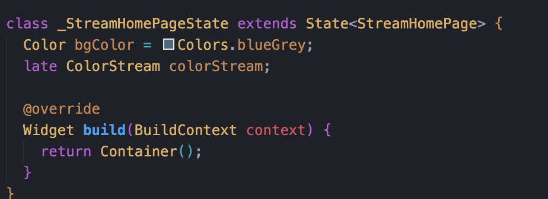
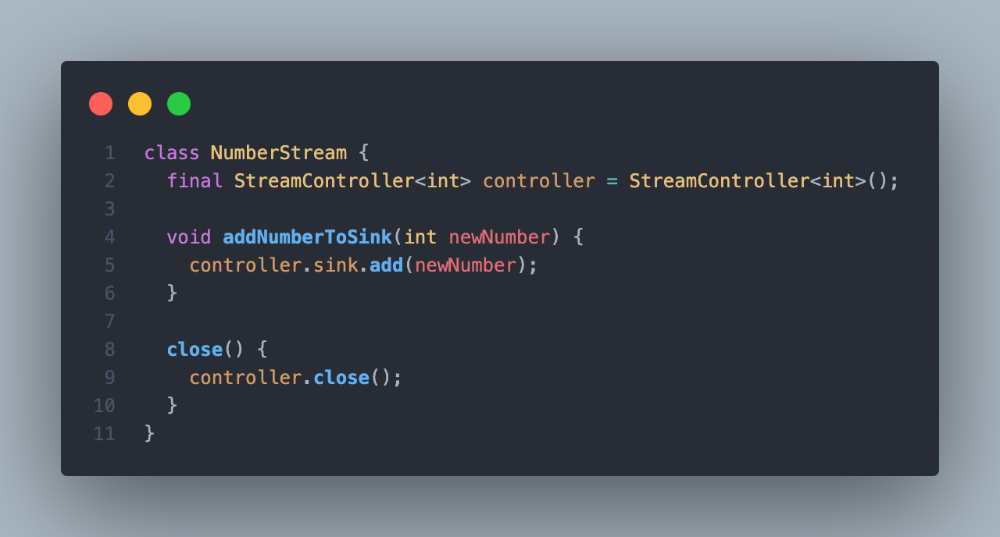
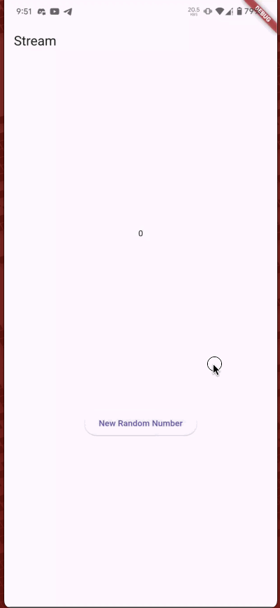

# Pemrograman Mobile - Pertemuan 12

<table>
    <thead>
        <th style="text-align: center;" colspan="2">Pertemuan 12</th>
    </thead>
    <tbody>
        <tr>
            <td>Nama</td>
            <td>Ridho Aulia' Rahman</td>
        </tr>
        <tr>
            <td>Nim</td>
            <td>2241720162</td>
        </tr>
    </tbody>
</table>

# Praktikum 1: Dart Streams

## Langkah 1: Buat Project Baru

Membuat projek baru dengan nama `stream_edo` dengan menggunakan perintah `flutter create stream_edo -e`.

## Langkah 2: Buka file main.dart

## Soal 1
- Tambahkan nama panggilan Anda pada title app sebagai identitas hasil pekerjaan Anda.

- Gantilah warna tema aplikasi sesuai kesukaan Anda.

### Jawaban

1. Menambahkan nama panggilan pada title app

## Langkah 3: Buat file baru stream.dart

Membuat file baru di folder lib dengan nama `stream.dart`

## Langkah 4: Tambah variabel colors

## Soal 2

Tambahkan 5 warna lainnya sesuai keinginan Anda pada variabel colors tersebut.

### Jawaban

1. Menambahkan 5 warna lainnya pada variabel colors

## Langkah 5: Tambah method getColors()

Menambahkan method getColors dengan async*

## Langkah 6: Tambah perintah yield*

Menambahkan kode yeild* 

## Soal 3

1. Jelaskan fungsi keyword yield* pada kode tersebut!

2. Apa maksud isi perintah kode tersebut?

### Jawaban

1. Fungsi keyword yield* pada kode tersebut adalah untuk mengembalikan nilai dari sebuah fungsi generator. Fungsi generator adalah fungsi yang menghasilkan nilai secara berurutan. Fungsi generator menggunakan kata kunci yield untuk mengembalikan nilai.

2. Maksud dari isi perintah kode tersebut adalah untuk mengembalikan nilai dari sebuah fungsi generator yang berisi list warna yang telah didefinisikan sebelumnya.

## Langkah 7: Buka main.dart

Import file stream.dart

## Langkah 8: Tambah variabel

Menambahkan 2 variabel bgColor dan colorStream

## Langkah 9: Tambah method changeColor()

Menambahkan method changeColor()

## Langkah 10: Lakukan override initState()

Menambahkan kode berikut pada method initState()

## Langkah 11: Ubah isi Scaffold()

Mengubah isi Scaffold()

## Langkah 12: Run

Menjalankan aplikasi

## Soal 4

Capture hasil praktikum Anda berupa GIF dan lampirkan di README.

### Jawaban

## Langkah 13: Ganti isi method changeColor()

Mengganti isi method changeColor()

## Soal 5
Jelaskan perbedaan menggunakan listen dan await for (langkah 9) !

### Jawaban

Perbedaan antara listen dan await for adalah sebagai berikut:
- listen: digunakan untuk mendengarkan perubahan pada stream yang diberikan. Ketika stream tersebut mengeluarkan data, maka listen akan mengeksekusi kode yang ada di dalamnya.

- await for: digunakan untuk menunggu stream yang diberikan mengeluarkan data. Ketika stream tersebut mengeluarkan data, maka await for akan mengeksekusi kode yang ada di dalamnya.

# Praktikum 2: Stream controllers dan sinks

## Langkah 1: Buka file stream.dart

import package dart:async

## Langkah 2: Tambah class NumberStream

Menambahkan class NumberStream

## Langkah 3: Tambah StreamController

Menambahkan StreamController

## Langkah 4: Tambah method addNumberToSink

Menambahkan method addNumberToSink

## Langkah 5: Tambah method close()

Menambahkan method close()

## Langkah 6: Buka main.dart

import package dart:async dan dart:math

## Langkah 7: Tambah variabel

Menambahkan variabel lastNumber, StreamController, dan NumberStream

## Langkah 8: Edit initState()

## Langkah 9: Edit dispose()

## Langkah 10: Tambah method addRandomNumber()

Menambahkan method addRandomNumber()

## Langkah 11: Edit method build()

## Langkah 12: Run

Menjalankan aplikasi

## Soal 6

1. Jelaskan maksud kode langkah 8 dan 10 tersebut!

2. Capture hasil praktikum Anda berupa GIF dan lampirkan di README.

### Jawaban

1. Maksud dari kode langkah 8 adalah untuk menginisialisasi variabel lastNumber, StreamController, dan NumberStream. Variabel lastNumber digunakan untuk menyimpan nilai terakhir dari stream yang dihasilkan. StreamController digunakan untuk mengontrol stream yang dihasilkan. NumberStream digunakan untuk mengatur stream yang dihasilkan.

Maksud dari kode langkah 10 adalah untuk menambahkan angka random dari 0-9 ke dalam stream yang dihasilkan. Angka random tersebut akan ditambahkan ke dalam sink yang ada pada stream yang dihasilkan.

2. 

## Langkah 13: Buka stream.dart

Mnambahkan method addError()

## Langkah 14: Buka main.dart

Tambahkan method onError di dalam class StreamHomePageState pada method listen di fungsi initState().

## Langkah 15: Edit method addRandomNumber()

Menambahkan kode untuk menambahkan error ke dalam stream

## Soal 7
1. Jelaskan maksud kode langkah 13 sampai 15 tersebut!

Kembalikan kode seperti semula pada Langkah 15, comment addError() agar Anda dapat melanjutkan ke praktikum 3 berikutnya.

### Jawaban

1. Maksud dari kode langkah 13 adalah untuk menambahkan error ke dalam stream yang dihasilkan. Error tersebut akan ditambahkan ke dalam sink yang ada pada stream yang dihasilkan.

# Praktikum 3: Injeksi data ke streams

## Langkah 1: Buka main.dart

Menambahkan variabel StreamTransformer

## Langkah 2: Tambahkan kode ini di initState

## Langkah 3: Tetap di initState

Mengubah bagian streamController

## Langkah 4: Run

Menjalankan aplikasi

## Soal 8
1. Jelaskan maksud kode langkah 1-3 tersebut!
2. Capture hasil praktikum Anda berupa GIF dan lampirkan di README.

### Jawaban

1. Langkah 1 adalah untuk menambahkan variabel StreamTransformer yang digunakan untuk mengubah data yang diterima dari stream. 

    Langkah 2 adalah untuk menginisialisasi variabel StreamTransformer yang telah didefinisikan sebelumnya. 

    Langkah 3 adalah untuk mengubah bagian streamController yang digunakan untuk mengontrol stream yang dihasilkan.

2. 

# Praktikum 4: Subscribe ke stream events

## Langkah 1: Tambah variabel

Menambahkan variabel StreamSubscription

## Langkah 2: Edit initState()

## Langkah 3: Tetap di initState()

Menaambahkan kode handle Error

## Langkah 4: Tambah properti onDone()

Menambahkan properti onDone()

## Langkah 5: Tambah method baru

Menambahkan method stopStream()

## Langkah 6: Pindah ke method dispose()

Menambahkan subscribe.cancel() ke dalam method dispose()

## Langkah 7: Pindah ke method build()

Menambahkan button kedua yaitu stopStream()

## Langkah 8: Edit method addRandomNumber()

## Langkah 9: Run

Menjalankan aplikasi

## Langkah 10: Tekan button `Stop Subscription`

Maka akan muncul tulisan 'OnDone was called'

## Soal 9

1. Jelaskan maksud kode langkah 2, 6 dan 8 tersebut!
2. Capture hasil praktikum Anda berupa GIF dan lampirkan di README.

### Jawaban

1. Langkah 2 adalah untuk menginisialisasi variabel StreamSubscription yang digunakan untuk melakukan subscribe ke stream yang dihasilkan. 

    Langkah 6 adalah untuk membatalkan subscribe ke stream yang dihasilkan ketika aplikasi dihentikan. 

    Langkah 8 adalah untuk menambahkan angka random dari 0-9 ke dalam stream yang dihasilkan. Angka random tersebut akan ditambahkan ke dalam sink yang ada pada stream yang dihasilkan.

2. 

# Praktikum 5: Multiple stream subscriptions

## Langkah 1: Buka file main.dart

Menambahkan variabel StreamSubscription dan String values

## Langkah 2: Edit initState()

## Langkah 3: Run

Akan terjadi error saat dijalankan

# Soal 10

1. Jelaskan mengapa error itu bisa terjadi ?

### Jawaban

1. Error terjadi karena stream yang dihasilkan hanya bisa di-subscribe satu kali. Ketika stream tersebut di-subscribe lebih dari satu kali, maka akan terjadi error.

## Langkah 4: Set broadcast stream

Mengubah stream yang dihasilkan menjadi broadcast stream

## Langkah 5: Edit method build()

Memasukkan variabel values ke dalam Text()

## Langkah 6: Run

Menjalankan aplikasi

## Soal 11
1. Jelaskan mengapa hal itu bisa terjadi ?
2. Capture hasil praktikum Anda berupa GIF dan lampirkan di README.

### Jawaban

1. Hal itu bisa terjadi karena stream yang dihasilkan telah diubah menjadi broadcast stream. Broadcast stream memungkinkan stream yang dihasilkan dapat di-subscribe lebih dari satu kali dan teks akan ditambahkan setiap kali tombol `Add Random Number` ditekan.

2. 

# Praktikum 6: StreamBuilder

## Langkah 1: Buat Project Baru

Membuat projek baru dengan nama `streambuilder_edo` dengan menggunakan perintah `flutter create streambuilder_edo -e`.

## Langkah 2: Buat file baru stream.dart

Membuat class NumberStream

## Langkah 3: Tetap di file stream.dart

Membuat method getNumbers() dengan async*.

## Langkah 4: Edit main.dart

## Langkah 5: Tambah variabel

Meambahkan variabel late Stream.

## Langkah 6: Edit initState()

## Langkah 7: Edit method build()

Menampilkan hasil stream yang dihasilkan.

## Langkah 8: Run

Menjalankan aplikasi

## Soal 12
1. Jelaskan maksud kode pada langkah 3 dan 7 !
2. Capture hasil praktikum Anda berupa GIF dan lampirkan di README.

### Jawaban

1. Langkah 3 adalah untuk membuat method getNumbers() yang digunakan untuk menghasilkan stream yang berisi list angka random dari 0-9. 

    Langkah 7 adalah untuk menampilkan hasil stream yang dihasilkan ke dalam aplikasi menggunakan StreamBuilder.

2. 

# Praktikum 7: BLoC Pattern

## Langkah 1: Buat Project baru

Membuat projek baru dengan nama `bloc_random_edo` dengan menggunakan perintah `flutter create bloc_random_edo -e`. lalu membuat file baru dengan nama `random_bloc.dart` di dalam folder lib.

## Langkah 2: Isi kode random_bloc.dart

Import package dart:async dan math

## Langkah 3: Buat class RandomNumberBloc()

Memasukkan kode class RandomNumberBloc() di dalam file random_bloc.dart

## Langkah 4: Buat variabel StreamController

Menambahkan variabel StreamController di class RandomNumberBloc()

## Langkah 5: Buat constructor

Menambahkan constructor di class RandomNumberBloc()

## Langkah 6: Buat method dispose()

Menambahkan method dispose() di class RandomNumberBloc()

## Langkah 7: Edit main.dart

## Langkah 8: Buat file baru random_screen.dart

Membuat file baru dengan nama `random_screen.dart` di dalam folder lib.

## Langkah 9: Lakukan impor material dan random_bloc.dart

Import package material dan random_bloc.dart

## Langkah 10: Buat StatefulWidget RandomScreen

Membuat class RandomScreen yang merupakan StatefulWidget

## Langkah 11: Buat variabel

Menambahkan variabel RandomNumberBloc di dalam class _RandomScreenState

## Langkah 12: Buat method dispose()

Menambahkan method dispose() di dalam class _RandomScreenState

## Langkah 13: Edit method build()

## Soal 13
1. Jelaskan maksud praktikum ini ! Dimanakah letak konsep pola BLoC-nya ?
2. Capture hasil praktikum Anda berupa GIF dan lampirkan di README.

### Jawaban

1. Maksud dari praktikum ini adalah untuk membuat aplikasi yang menggunakan pola BLoC. Pola BLoC adalah pola yang digunakan untuk memisahkan antara logika bisnis dan tampilan. Konsep pola BLoC terletak pada class RandomNumberBloc() yang digunakan untuk mengatur stream yang dihasilkan. setiap perubahan pada stream akan diatur oleh class RandomNumberBloc() dan akan ditampilkan ke dalam aplikasi menggunakan StreamBuilder.

2. 
